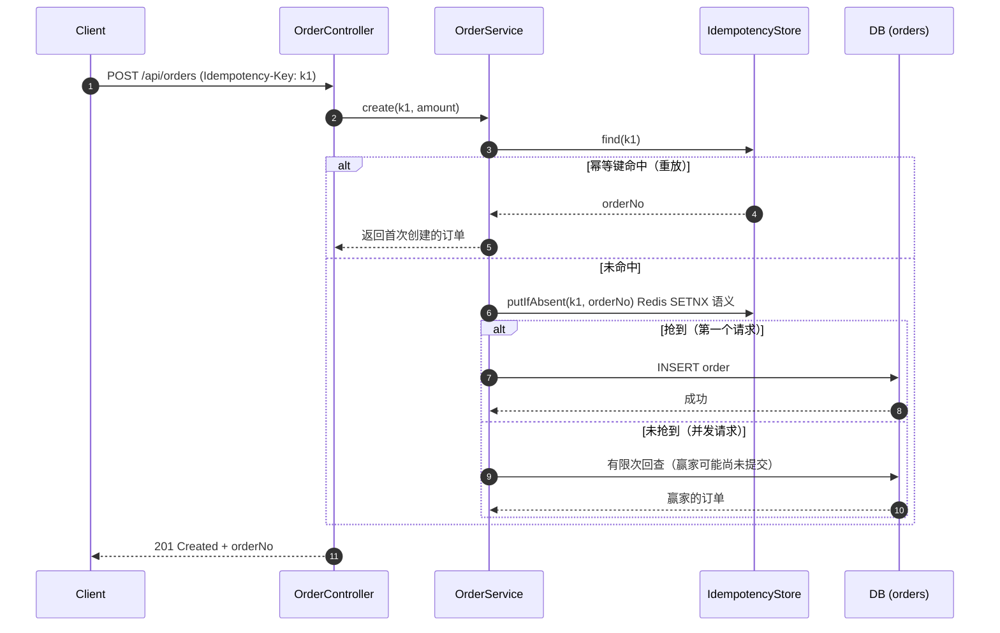

# order-reliability-kit

[](https://github.com/lilsawe/order-reliability-kit/actions/workflows/ci.yml)


[](LICENSE)

> A compact, production-shaped Spring Boot service for **idempotent order creation**, an **order state machine**, and **two-way reconciliation** — 48 tests + CI.

一个用 Spring Boot 写的**订单服务实践项目**，聚焦后端工程里最容易出事故的三件事：**接口幂等**、**状态流转**、**对账**。

> 说明：这是个人实践项目（个人工程实践，非生产系统），目的是把真实业务里反复用到的模式抽成可运行、可测试的最小实现。

## 为什么做这个

- 下单/支付接口被重复调用（用户连点、网络重试、消息重投）会直接造成**重复下单、重复扣款**
- 订单状态散落在各处 if-else 里维护，改一处崩一处
- 本地订单与渠道账单不一致时，需要**自动化对账**把差异分类出来

这个项目把这三件事各做成一个可独立测试的模块。

## 模块结构：一个库 + 一个示例

| 模块 | 是什么 | 测试 | 行覆盖率 |
|---|---|---|---|
| **kit** | **可复用组件**（框架无关）：幂等存储抽象 + 自动装配、通用状态机、通用双向对账引擎 | 27 | **99.0%** |
| **example** | **示例服务**：用 kit 实现订单的下单幂等 / 状态流转 / 对账，带 Swagger、压测脚本与冒烟脚本 | 21 | 92.8% |

> 为什么拆两个模块？**「能跑」和「能被复用」是两种能力**。业务代码写三遍会用，抽象成组件才是工程能力——
> 所以幂等、状态机、对账的通用部分抽进 §kit§，订单相关的部分留在 §example§。

## 作为库使用（kit）

§§§bash
mvn -B -ntp install -DskipTests     # 或 make install
§§§

§§§xml
<dependency>
    <groupId>com.lilsawe</groupId>
    <artifactId>kit</artifactId>
    <version>0.2.0</version>
</dependency>
§§§

引入依赖后**自动装配生效**，不需要在业务侧手写 @Bean：

§§§java
// 1) 通用状态机：只声明转移表，业务侧不再写 if-else
StateMachine<OrderStatus, OrderEvent> machine = StateMachine.<OrderStatus, OrderEvent>builder()
        .on(CREATED, PAY, PAID)
        .on(PAID, SHIP, SHIPPED)
        .terminal(SHIPPED)
        .build();
machine.next(CREATED, PAY);                   // PAID
machine.assertCanTransit(CREATED, SHIPPED);   // 抛 IllegalStateException

// 2) 通用双向对账：给「取键 + 取金额」两个函数，可比对任意两张表
ReconcileReport report = Reconciler.compare(
        localOrders, channelSettlements,
        OrderEntity::getOrderNo, OrderEntity::getAmountCent,
        ChannelOrder::channelOrderNo, ChannelOrder::amountCent);
report.diffs();   // 一致 / 左侧多 / 右侧多 / 金额不一致

// 3) 幂等存储：默认内存实现，一行配置切 Redis
@Autowired IdempotencyStore store;
§§§

| 配置 | 效果 |
|---|---|
| §kit.idempotency.store: memory§（默认） | 内存实现：单实例 / 本地开发 / 测试，零依赖 |
| §kit.idempotency.store: redis§ | Redis 实现：多实例生产，SETNX + 24h TTL |
## 核心设计

### 1. 接口幂等：三层防线

| 层 | 手段 | 作用 |
|---|---|---|
| 第一层 | IdempotencyStore（Redis SETNX + TTL / 内存 CAS） | 并发请求只有第一个能抢到幂等键 |
| 第二层 | 数据库唯一索引 uk_orders_idempotency_key | 存储层兜底，进程重启、缓存丢失也不会写入重复订单 |
| 第三层 | 重放返回首次创建的订单 | 调用方拿到**完全相同**的结果，天然可重试 |

请求头携带 Idempotency-Key，同一个 key 重复调用只落库一次（单元测试用 Mockito 验证 save 只被调用 1 次）。

### 2. 状态机

```text
CREATED ──▶ PAID ──▶ SHIPPED
   │          │
   └──────────┴──▶ CANCELLED
```

OrderStateMachine 集中定义合法流转，非法流转抛 IllegalStateException（HTTP 409）。实体带 @Version 乐观锁，防止并发覆盖。

### 3. 对账

ReconcileService 把本地订单与渠道结算记录按订单号双向比对，输出四类结果：

| 类型 | 含义 |
|---|---|
| 一致（matched） | 两侧订单号与金额都相同 |
| MISSING_IN_CHANNEL | 本地有、渠道无 —— 可能漏推送 |
| MISSING_IN_LOCAL | 渠道有、本地无 —— 可能漏记或重复扣款 |
| AMOUNT_MISMATCH | 两侧都有但金额不一致 |

## 快速开始（三种方式，按需选）

| 方式 | 命令 | 适用场景 |
|---|---|---|
| **零依赖**（H2 内存库） | §make run§ | 想立刻看效果，不用装任何东西 |
| **MySQL + Redis** | §make docker-up && make run-mysql§ | 想验证真实中间件（幂等键走 Redis） |
| **打 jar 部署** | §mvn -B -ntp package && java -jar target/*.jar§ | 部署到服务器 |

启动后可以直接打开：

| 地址 | 用途 |
|---|---|
| **http://localhost:8080/swagger-ui.html** | ⭐ **Swagger UI —— 浏览器里直接试接口**，不用写 curl |
| http://localhost:8080/actuator/health | 健康检查（UP/DOWN + 各组件状态） |
| http://localhost:8080/actuator/prometheus | Prometheus 指标（QPS/延迟/错误率） |
| http://localhost:8080/h2-console | H2 控制台（JDBC URL: jdbc:h2:mem:orders） |

## Makefile 命令

§§§bash
make help        # 列出所有命令
make run         # 本地启动（H2，零依赖）
make run-mysql   # 用 MySQL + Redis 启动
make test        # 跑测试
make coverage    # 测试 + 覆盖率报告（自动打开）
make smoke       # 一键冒烟：幂等/状态机/对账（需先 make run）
make bench       # 压测（需先 make run）
make docker-up   # 启动 MySQL + Redis
make clean       # 清理构建产物
§§§

## 一键冒烟（12 项检查）

§§§bash
make run            # 终端 1
make smoke          # 终端 2
§§§

冒烟脚本会真实走一遍业务主线，全部通过才返回 0（已接入 CI）：

| 检查项 | 期望 |
|---|---|
| 健康检查 §/actuator/health§ | 200 / status=UP |
| 创建订单 | 201 + 返回 orderNo |
| **重复投递同一幂等键** | 返回**同一个** orderNo |
| 缺少 Idempotency-Key | 400 |
| 非法流转 CREATED→SHIPPED | 409 |
| 合法流转 CREATED→PAID | 200 + status=PAID |
| **20 并发共用同一幂等键** | 只产生 **1** 笔订单 |
| 触发对账 | 200 + 含 diffs 明细 |
## API 示例

```bash
# 创建订单（带幂等键）
curl -i -X POST http://localhost:8080/api/orders -H "Content-Type: application/json" -H "Idempotency-Key: order-key-001" -d "{\"amountCent\": 9900}"

# 用同一个幂等键再调一次：返回同一笔订单，不会重复创建
curl -i -X POST http://localhost:8080/api/orders -H "Content-Type: application/json" -H "Idempotency-Key: order-key-001" -d "{\"amountCent\": 9900}"

# 查询订单
curl http://localhost:8080/api/orders/{orderNo}

# 状态流转
curl -X POST http://localhost:8080/api/orders/{orderNo}/status -H "Content-Type: application/json" -d "{\"status\": \"PAID\"}"

# 触发对账（演示渠道数据会造出 1 笔金额差异 + 1 笔渠道多单）
curl http://localhost:8080/api/reconcile
```

## 测试与 CI

```bash
mvn -B -ntp verify
```

- OrderStateMachineTest：合法/非法状态流转、终态、幂等流转
- OrderServiceIdempotencyTest：同 key 只落库一次、不同 key 不同订单、唯一索引兜底、参数校验
- ReconcileServiceTest：四类差异分类、完全一致场景
- OrderServiceApplicationTests：@SpringBootTest 端到端冒烟（真实 Spring 上下文 + H2）

CI：GitHub Actions（Temurin JDK 17）执行 mvn -B -ntp verify。

## 项目结构

```text
src/main/java/com/lilsawe/order
├── api/                 # Controller、DTO、全局异常处理
├── domain/              # 实体、Repository、状态机
├── idempotency/         # 幂等键存储抽象 + Redis / 内存实现
├── reconcile/           # 对账服务、差异模型、渠道网关
└── service/             # 订单服务、订单号生成
```

## 后续可以扩展

- 幂等键存储换成 Redisson 看门狗续期，覆盖长事务场景
- 对账结果落库 + 定时任务（Spring Scheduling）做 T+1 自动对账
- 引入 Testcontainers，在 CI 里跑真实 MySQL / Redis
- 增加 Micrometer 指标：幂等命中率、对账差异数

## 架构与并发



## 并发与压测（真实数据，可复现）

```bash
# 终端 1：启动服务（H2 内存库，零依赖）
mvn -B -ntp -pl example -am spring-boot:run

# 终端 2：跑压测（Node 18+，无第三方依赖）
CONCURRENCY=200 REQUESTS=2000 node benchmark/load-test.mjs
```

**测试环境**：Apple M4 / 16 GB / macOS 27.2 / Temurin JDK 17.0.20.1 / H2 内存库 / 单实例

| 场景 | 请求数 / 并发 | QPS | P50 | P95 | P99 | 失败 |
|---|---|---|---|---|---|---|
| A. 独立幂等键下单（吞吐） | 2000 / 200 | **2460** | 62 ms | 191 ms | 229 ms | 0 |
| B. **同一幂等键并发**（幂等压制） | 200 / 200 | 3077 | 39 ms | 59 ms | 61 ms | 0 |

**场景 B 的结论**：200 个并发请求共用同一个幂等键，服务端最终**只有 1 笔订单**。压测脚本会校验「返回的不同订单号数量 == 1」，不满足则退出码非 0，可直接接进 CI。

> 这是**本机单实例 + 内存数据库**的数据，用于证明「幂等在并发下真的生效」，不代表生产容量。生产需要压到 MySQL/Redis 并用多副本验证。

## 踩坑记录：并发下的「可见性窗口」（真实 flake 定位过程）

**现象**：200 并发共用同一幂等键时，**偶发**（约每 10 次出现 1 次）：

```text
java.lang.IllegalStateException: 幂等键 CONCURRENT-KEY-1 已占用，但订单 OD2026... 不存在
```

**定位过程**：并发测试偶发失败 → 在测试里捕获并打印异常类型与消息（而不是只统计数量）→ 拿到堆栈 → 发现是**第二条路径**没处理：

| 并发路径 | 修复前处理 | 结果 |
|---|---|---|
| ① 未抢到幂等键（`putIfAbsent` 返回 false） | 回查 | 已修复（第一版） |
| ② **已读到键占位，但赢家事务尚未提交** | 直接查库 | ❌ **抛异常（漏掉的路径）** |

**根因**：幂等键是「先占位、后落库」，占位与提交之间存在**可见性窗口**——此时键已存在，但订单行对其它事务不可见。两条路径都会踩到，必须统一处理。

**修复**：两条路径统一走 `awaitExistingOrder`——**有限次、带间隔的回查**（50 次 x 10 ms）；命中即返回同一订单，超时才抛「处理中，请稍后重试」。同时删掉已无调用方的旧方法，避免死代码。

**验证**：200 线程并发测试**连跑 10 次全绿**；压测脚本场景 B（200 并发 -> 1 笔订单）。

**生产更优解**（面试可展开）：

1. 等待超时后返回 **202 Accepted**（语义比 500 更准），让调用方轮询查询接口
2. 改为「直接 INSERT，唯一索引冲突后 SELECT」——把并发控制交给数据库，避免应用层轮询
3. 幂等键写入「处理中」占位状态，结果落库后再置为「已完成」，调用方据此区分两种状态
## 测试与覆盖率

| 指标 | 数值 |
|---|---|
| 测试数量 | **48 个**（kit 27：状态机 10 · 对账引擎 6 · 内存幂等 4 · Redis 幂等 4 · 自动装配 3；example 21：状态机 5 · 幂等单测 5 · 对账 2 · HTTP 契约 7 · 端到端 1 · 并发 1） |
| 行覆盖率（JaCoCo） | **95.2%** 合计（kit 99.0% / example 92.8%） |
| 分支覆盖率 | kit 96.7% / example 84.8% |

```bash
mvn -B -ntp verify                    # 跑测试 + 生成覆盖率报告
open example/target/site/jacoco/index.html   # 查看报告
```
## 面试考点（把项目讲成答案）

| 问题 | 答案要点 |
|---|---|
| **幂等有哪几种方案？怎么选？** | ①**唯一索引**：强一致必防重（下单/支付），需设计幂等键，冲突抛异常；②**幂等表**：需记录请求与结果映射，多一次写库；③**Redis SETNX + TTL**：高并发、可容忍极小概率漏防，缓存丢了靠数据库兜底；④**状态机前置校验**：只覆盖状态类操作；⑤**分布式锁**：串行化临界区，性能损耗大且不解决「重复请求返回什么」。本项目=③+①+「返回首次结果」 |
| **有幂等键存储了，为什么还要唯一索引？** | 缓存会丢（重启/过期/被清）。唯一索引是**存储层最后一道闸门**：即使幂等键失效，两个并发请求也绝不可能写入两行订单——**性能靠缓存，正确性靠数据库** |
| **重复请求应该返回什么？** | 返回**首次创建的那笔订单**（相同 orderNo 与内容），而不是报错。调用方拿到可预期结果，天然支持重试 |
| **幂等键 TTL 怎么定？** | 取 **24h**。原则：大于业务可能的重试窗口（客户端重试、MQ 重投、人工补单），又不能让键无限堆积；支付类常 24h~7d，配合唯一索引可永久防重 |
| **两个请求同时进来会怎样？** | SETNX 原子操作只有一个能成功；未抢到的直接**回查并返回同一笔订单**；极端情况下（键刚过期）唯一索引兜底 |
| **为什么把状态流转抽成状态机？** | ①合法流转集中一处，改规则不用满项目找 if-else；②非法流转统一抛异常（409），接口语义清晰；③状态机是纯函数，**可脱离数据库单测** |
| **并发改状态怎么防覆盖？** | JPA 的 `@Version` 乐观锁：更新带版本号，冲突抛 OptimisticLockingFailureException。订单属「读多写少、冲突概率低」，乐观锁比悲观锁吞吐更好 |
| **对账能对出哪几类差异？** | 四类：一致 / **本地有渠道无**（漏推送、渠道未结算）/ **渠道有本地无**（漏记账、重复扣款）/ **金额不一致**（费率、退款、部分结算）。定位顺序：订单号双向 diff → 按金额与状态分层 → 与渠道流水逐笔核对 |
| **金额为什么用 long（分）不用 double？** | 浮点有精度误差（0.1+0.2 != 0.3），资金场景必须用**最小货币单位的整数**（分）或 BigDecimal。本项目全链路用分 |
| **这个项目离生产还差什么？** | 见下节「已知限制」——面试时**主动说出差距**远好于被问出来 |

## 设计取舍 / 已知限制 / 下一步

### 设计取舍（为什么这么做）

| 决策 | 选择 | 为什么 |
|---|---|---|
| 幂等键存储 | 抽象 `IdempotencyStore`，默认内存、可切 Redis | 单元测试**不依赖外部组件**，同时保留生产形态 |
| 默认数据库 | H2 内存库 | 克隆后 `mvn spring-boot:run` 直接能跑，降低他人上手成本 |
| 对账数据源 | `ChannelGateway` 接口 + 演示实现 | 真实渠道账单不宜开源，用接口隔离并留可替换点 |
| 状态流转 | 独立状态机类，不引工作流引擎 | 四个状态用引擎属过度设计 |
| 冲突处理 | 乐观锁 `@Version` | 订单写冲突概率低，乐观锁吞吐更好 |

### 已知限制（诚实说明）

- **单库单表**：无分库分表、无分布式事务（真实资金链路需 TCC/Saga 或 Seata）
- **对账结果不落库**：只返回报告，没有 T+1 任务与差异工单流转
- **无鉴权 / 限流**：未接入认证、风控与接口限流
- **幂等键 TTL 固定 24h**，未按业务分级
- **模拟渠道网关**按本地订单造数据，用于展示对账输出

### 下一步（如果继续做）

1. 幂等键换 Redisson（看门狗续期），覆盖长事务
2. 对账结果落库 + Spring Scheduling 做 T+1 自动对账与差异告警
3. Testcontainers 在 CI 里跑真实 MySQL / Redis
4. Micrometer 指标：幂等命中率、对账差异数、状态流转耗时
5. 接入 Seata，演示跨服务下单 + 扣款的分布式事务
## License

[MIT](LICENSE)
